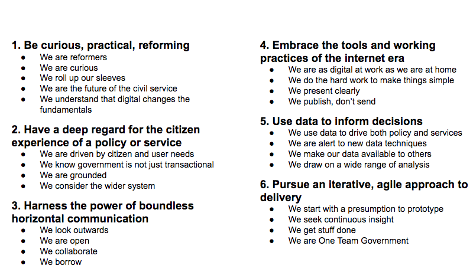

## Table of contents
{: .no_toc .text-delta }

1. TOC
{:toc}

## Team Manifesto

A social contract among your team members which contain a set of norms, values and behaviors that forms a solid ground for collaboration within your team. It highlights 

- Behaviors that embody your shared team values and purpose
- How you work together
- What you do and do not stand for
- How you hold each other accountable to remain a united front

### Sample Manifesto

## Definition of Ready

Definition of Ready describes the requirements that must be met in order for a story to move from the backlog to development or Simply stated, the Definition of Ready defines the criteria that a specific user story has to meet before being considered for estimation or inclusion into a sprint.

> Note:  If a user story is not Ready in the beginning of the Sprint it increases the chance that the story will not be done at the end of this sprint.

#### Sample Checklist

- [ ] User Story is defined and clear.
- [ ] User Story is feasible & testable
- [ ] User Story Acceptance Criteria defined
- [ ] User Story dependencies identified
- [ ] User Story sized by Development Team
- [ ] Scrum Team accepts User Experience artefacts
- [ ] Performance criteria identified, where appropriate
- [ ] Scalability criteria identified, where appropriate
- [ ] Security criteria identified, where appropriate
- [ ] Person who will accept the User Story is identified
- [ ] Team has a good idea what it will mean to Demo the User Story

## Definition of Done

The Definition of Done is an agreement between Development Team and the Product Owner on what needs to be completed for each user story – and it is often standardized across the company in order to guarantee consistent delivery of quality.

To close a user story, or a sprint it is important to verify that the tasks are complete. The development team should decide together what their Definition of Done is and document this in the project. 

### Sample Checklist

- [ ] Code produced (all ‘to do’ items in code completed)
- [ ] Code commented, checked in and run against current version in source control
- [ ] Peer reviewed (or produced with pair programming) and meeting development standards
- [ ] Builds without errors
- [ ] Unit tests written and passing
- [ ] Deployed to system test environment and passed system tests
- [ ] Passed UAT (User Acceptance Testing) and signed off as meeting requirements
- [ ] Any build / deployment / configuration changes are implemented / documented / communicated
- [ ] Relevant documentation / diagrams produced and / or updated
- [ ] Remaining hours for task set to zero and task closed