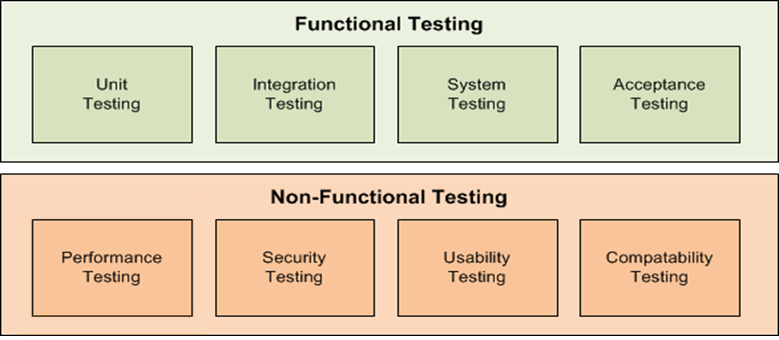

## Table of contents
{: .no_toc .text-delta }

1. TOC
{:toc}

## Overview

Continuous testing is the process of executing automated tests as part of the delivery pipeline to obtain immediate feedback on the business risks associated with a software release candidate.

Following image shows the phases of testing that could be considered for the scope of continuous testing.

## Participants

1. Developers
2. QA Engineers
3. DevOps Engineers

## Outcomes

- Delivery Pipeline with automated testing
- Faster feedback to the developers for the features developed
- Identify the risks early by executing automated non-functional testing
- System stability for ensuring the changes not impacting the existing functionality