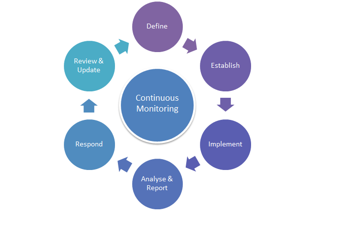

## Table of contents
{: .no_toc .text-delta }

1. TOC
{:toc}

## Overview
Continuous monitoring refers to the process and technology required to incorporate monitoring across IT operations lifecycle. It helps to continuously ensure the health, performance, and reliability of application and infrastructure. 

It alos called continuous control monitoring (CCM), is a process that allows SRE teams to detect compliance and security threats. Maintaining ongoing awareness of information security, vulnerabilities, and threats to support organizational risk management decisions. 

Continuous monitoring includes both automated and procedural (manual) methods. The following are the steps to be followed to implement continuous monitoring

Continuous Monitoring have following categroies 
- Customer Experience Monitoring
- Application Monitoring
- Database Monitoring 
- Infrastructure Monitoring
- Security Monitoring
- Network Monitoring

## Participants
1. Operations
2. SRE
3. Security Engineers

## Outcomes
- Improved Security.
- Better Record-keeping of Threats and Compliance Issues. 
- Catch Performance Issues Earlier 
- Avoid Downtime or Service Loss.
- Improved Customer Satisfaction.
