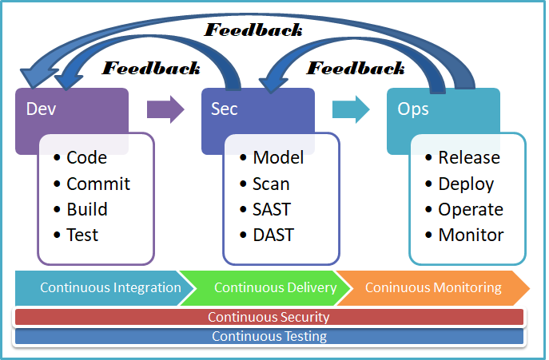

# DevSecOps Overview

DevSecOps stands for development, security, and operations. It's an approach to culture, automation, and platform design that integrates security as a shared responsibility throughout the entire IT lifecycle. As shown below the five build blocks to build the successful devsecops are

1. Continuous Testing
2. Continuous Security
3. Continuous Integration
4. Continuous Delivery/Deployment
5. Continuous Monitoring

